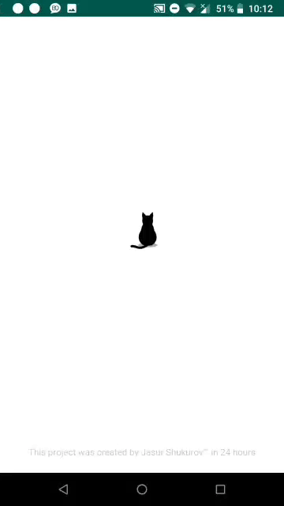
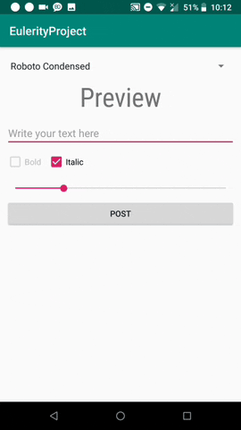

# Eulerity-Hackathon
GET AND POST REQUEST SIMPLE APP 

# Task 

Here's a list of what your final project should do.

Display a list of fonts:

Make a GET request to /fonts/all to retrieve an array of JSON objects.
The JSON object will contain an "URL" attribute pointing to a font file, a string attribute "family", which is the family name of a font, a boolean attribute "bold" which determines if the font is bold, and a boolean "italic" which determines if the font is italic. If both are false, this means the font file is the default font without any style. If both are true, this means the font file is both bold and italic.

Allow editing of an EditText

Allow the user to choose a font

Allow the user to choose bold or italic or both if it is available

Allow some other interesting edits to an editext...be creative

Save the changes

POST a JSON to the /makeText endpoint with the following fields :
  
  appid: a string unique to your project (e.g. your email address)
  
  fontFamilyName: the Family Name of the font the user used
  
  bold: a boolean if the user used the bold styling
  
  italic: a boolean if the user used the italic styling
  
  textTyped: the string typed in the EditText
  
  url : url of the font the user used

Any other fields you come up with.

